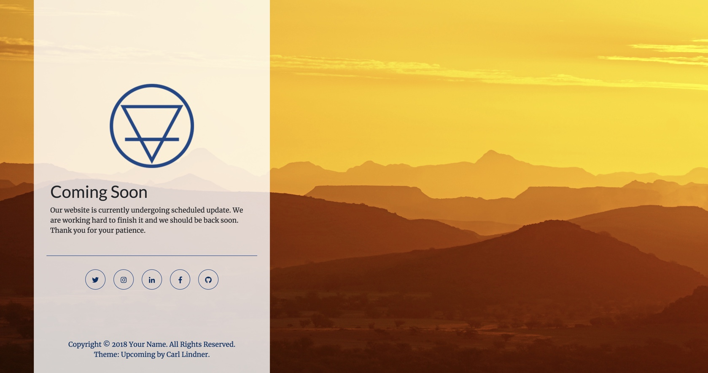

# Upcoming: An Under Construction Template

Upcoming is a simple "coming soon" and/or under construction template used to create a parking page for a new personal website. It uses Bootstrap styling and Fontawesome icons.

## Preview

**[Live Preview](https://www.lindner.haus)**

## Usage

After forking, cloning, or downloading the template, simply open and edit the `index.html` in your favorite text editor. You can also edit the `theme.css` file if you want to add your own unique flair. These are the only files you really need to worry about besides the images. You can and should ignore everything else! To preview the changes you make to the code, save and then open the `index.html` file in your regular web browser.

## Getting Started

You will need to make this template your own. To help, here is a list of the major revisions you need to make:

1. Replace the logo with one of your own
2. Add your own heading and text to fit your website needs
3. Update the social icons with your own links
4. Update the Copyright in the footer with your name and date
5. Replace the background image with one you like (Optional)

Of course, there is a whole lot more you can do. I cannot go through every possible option available. You will have to explore on your own.  

## Bugs and Issues

Have a bug or an issue with this template? [Open a new issue](https://github.com/cjlindner/teaport/issues) here on GitHub and I will work to address it as quickly as I can.

## Changelog
### 2.0
* Released: January 4, 2025
* Updated Bootstrap to v5.3.8
* Updated FontAwesome to v7.1.0
* Updated Layout

### 1.0
* Released: August 18, 2018
* Initial release

## Copyright and License

Copyright 2017-2025 Carl Lindner. Code released under the [MIT](https://github.com/cjlindner/teaport/blob/gh-pages/LICENSE) license.
